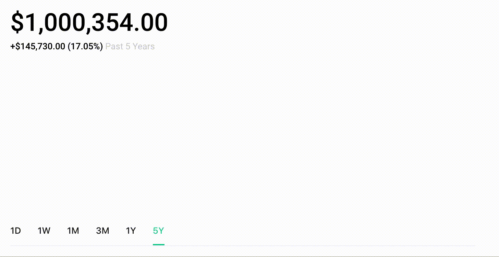

# Legolas

[See it live](https://legolas-robinhood-clone.herokuapp.com/)

Legolas, a Robinhood clone, is an investing app where you can try out a crazy
investing strategy without putting real money on the line. Rails and Postgres
power the backend, while React and Rails handle the frontend.

This project was designed and built in under two weeks.

## Features

- Authentication using BCrypt
- Users can search for stock and see its performance
- Users can buy and sell stocks
- The dashboard shows the performance of the user's own portfolio
- Users can watch stocks
- Watched stocks are listed in the dashboard sidebar

### Portfolio Graph

The main feature of the app is showing a graph of the user's portfolio. It's
easy enough to pull a single stock's performance from an API, but the user's
portfolio combines multiple stocks together. Not only that, but the user's
portfolio may change over time. Because of this it's necessary to not only be
able to fetch the shares the user owns now, but also the shares the user owned
at any given point of time.

This was accomplished using a `transactions` table. Each transaction stores a
`user_id`, a stock `symbol`, the number of `shares` bought or sold, and the
`time` the transaction was made. Shares are positive if the user bought shares,
and negative if the user sold shares.

For example, if user 1 bought 100 shares of Apple on October 19th, 2018 at 10:34
AM, the transaction would look like this:

`user_id` | `symbol` | `shares` | `time`
----------|----------|----------|----------------------------
`1`       | `AAPL`   | `100`    | `2018-10-19 10:35:26 -0400`

If user 1 sold 50 shares of Facebook on October 20th, 2018 at 2:13 PM, the
transaction would look like this

`user_id` | `symbol` | `shares` | `time`
----------|----------|----------|----------------------------
`1`       | `FB`     | `-50`    | `2018-10-10 14:13:34 -0400`

Given these transactions, we can find out how many shares the user owned of any
given stock, at any given time. This is accomplished with the following query:

```ruby
def shares_of(symbol, at_time: Time.now)
  transactions
    .where(symbol: symbol.upcase)
    .where("time <= ?", at_time)
    .sum(:shares)
end
```

(The context here is the user so `transactions` here refers to only that user's
transactions)


